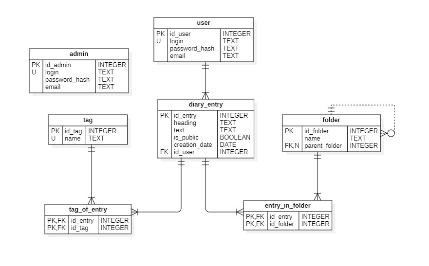

# Личный дневник

## Требования
- Регистрация пользователя
	- Доступ к функциональности ограничен только зарегестрированными пользователями
- Логин и логаут пользователя
- Просмотр своих записей или публичных записей других пользователей
	- Записи должны быть упорядочены по дате создания с возможностью сортировки
	- Каждая запись должна отображать заголовок, дату создания, опцию для просмотра записи, изменения, удаления своей записи
- Создание новой записи
- Редактирование записи
	- Редактирование заголовка 
	- Редактирование текста записи
	- Возможность сделать запись публичной
- Удаление записи

## Роли
- Пользователь 
	- Может просматривать только свои записи и чужие публичные
	- Может редактировать и удалять только свои записи
- Администратор
	- Может просматривать записи любого пользователя
	- При необходимости может скрыть или удалить записи, нарушающие правила использования приложения

